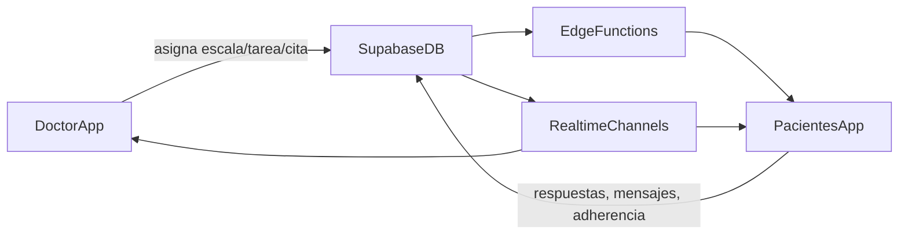

# Plan Maestro App Pacientes (MVP de comunicación + escalas)

## Objetivo del plan

Construir una app nueva en la carpeta `Pacientes` que use el mismo stack y dependencias de la app actual, comparta la misma base de datos de expediente clínico y habilite un flujo seguro, trazable y escalable para:

- Mensajería médico-paciente (bidireccional en MVP).
- Envío/recepción de escalas clínicas.
- Timeline de tareas terapéuticas y adherencia.
- Agendamiento desde disponibilidad del médico.

## Base técnica que se reutiliza (actual)

- Frontend y runtime actual: `React 18 + TypeScript + Vite + Tailwind + React Router + React Query` desde [package.json](C:/Users/JmYoc/.cursor/worktrees/ExpedienteDLM-11/wzf/package.json).
- Cliente Supabase tipado ya existente: [src/lib/supabase.ts](C:/Users/JmYoc/.cursor/worktrees/ExpedienteDLM-11/wzf/src/lib/supabase.ts) y [src/lib/database.types.ts](C:/Users/JmYoc/.cursor/worktrees/ExpedienteDLM-11/wzf/src/lib/database.types.ts).
- Flujos útiles ya implementados:
  - Registro por token y escalas: [src/pages/PatientPublicRegistration.tsx](C:/Users/JmYoc/.cursor/worktrees/ExpedienteDLM-11/wzf/src/pages/PatientPublicRegistration.tsx)
  - Edge function de cierre de registro: [supabase/functions/complete-patient-registration/index.ts](C:/Users/JmYoc/.cursor/worktrees/ExpedienteDLM-11/wzf/supabase/functions/complete-patient-registration/index.ts)
  - Servicio de escalas: [src/lib/services/medical-scales-service.ts](C:/Users/JmYoc/.cursor/worktrees/ExpedienteDLM-11/wzf/src/lib/services/medical-scales-service.ts)
  - Citas: [src/lib/services/enhanced-appointment-service.ts](C:/Users/JmYoc/.cursor/worktrees/ExpedienteDLM-11/wzf/src/lib/services/enhanced-appointment-service.ts)
  - Portal paciente actual (base conceptual): [src/components/Layout/PatientPortalLayout.tsx](C:/Users/JmYoc/.cursor/worktrees/ExpedienteDLM-11/wzf/src/components/Layout/PatientPortalLayout.tsx) y [src/pages/PrivacyDashboard.tsx](C:/Users/JmYoc/.cursor/worktrees/ExpedienteDLM-11/wzf/src/pages/PrivacyDashboard.tsx)

## Arquitectura objetivo (alto nivel)

## Requerimientos técnicos (lista completa para comunicación correcta)

### 1) Estructura de proyecto y dependencias

- Crear app independiente en `Pacientes` con el mismo lenguaje y librerías base de la app principal (React, TS, Vite, Tailwind, React Query, Supabase JS).
- Definir estrategia de código compartido sin duplicación crítica:
  - Opción recomendada: paquete compartido interno (`shared/`) para tipos, cliente Supabase y utilidades de escalas.
- Estandarizar variables de entorno por app (`VITE_SUPABASE_URL`, `VITE_SUPABASE_ANON_KEY`) con convención idéntica a [src/lib/supabase.ts](C:/Users/JmYoc/.cursor/worktrees/ExpedienteDLM-11/wzf/src/lib/supabase.ts).

### 2) Contrato de datos y baseline de esquema

- Congelar un baseline real de tablas usadas por flujo paciente (porque hay señales de drift entre migraciones y uso en código).
- Tablas mínimas confirmadas para MVP:
  - `patients`, `patient_registration_tokens`, `medical_scales`, `scale_assessments`, `appointments`, `notifications`.
- Agregar especificación de ownership por entidad:
  - Médico dueño (doctor_id), paciente dueño (patient_user_id), clínica (clinic_id), timestamps, estado.
- Definir versionado de payload JSON para escalas (`definition_version`, `answered_at`, `source_app`).

### 3) Seguridad y RLS (bloque crítico)

- Revisión y endurecimiento de políticas RLS por tabla paciente (lectura/escritura mínima necesaria).
- Requisitos obligatorios:
  - Paciente autenticado solo ve su expediente por `patients.patient_user_id = auth.uid()`.
  - Médico/clinic staff solo ven pacientes de su relación clínica/doctor.
  - Escalas y mensajes aislados por relación médico-paciente.
  - Catálogo de escalas (`medical_scales`) con política explícita de lectura segura (evitar dependencia de configuración implícita).
- Forzar que cualquier operación sensible del paciente pase por Edge Functions con validación de ownership.

### 4) Identidad del paciente y onboarding

- Modelo MVP recomendado:
  - Mantener enlace por token para primer alta.
  - Al completar alta, asociar o crear identidad paciente en `auth.users` y enlazar `patients.patient_user_id`.
- Requerimientos del onboarding:
  - Token con expiración corta, uso único y estado auditable.
  - Idempotencia en registro (evitar duplicados si reintenta envío).
  - Trazabilidad completa del origen (`token`, `doctor_id`, `clinic_id`).

### 5) Escalas: envío, respuesta y lectura clínica

- Flujo objetivo:
  - Médico asigna escala/programación -> paciente recibe tarea -> paciente responde -> doctor visualiza score/severidad/alerta.
- Requisitos de datos para `scale_assessments` (MVP):
  - `scale_id`, `patient_id`, `doctor_id`, `answers`, `score`, `severity`, `created_at`, `updated_at`, `interpretation`.
  - Añadir `assignment_id` o `source` para distinguir si vino de consulta, campaña o trigger automático.
- Requisito funcional: cálculo de semáforo clínico por umbrales (verde/amarillo/rojo) y persistencia de estado para tablero médico.

### 6) Comunicación bidireccional (MVP)

- Definir módulo de mensajería clínica mínimo:
  - Conversación por relación `doctor_id + patient_id`.
  - Mensajes con estado (`sent`, `delivered`, `read`), adjuntos opcionales y timestamps.
- Realtime:
  - Canal por conversación con filtros estrictos por usuario autenticado.
- Controles:
  - Anti-spam básico (rate limit por usuario).
  - Moderación mínima (bloqueo por relación inactiva o egreso).

### 7) Timeline de tareas y terapia

- Crear entidades para tareas diarias (MVP):
  - `patient_tasks` y `patient_task_events`.
- Tipos de tarea iniciales:
  - `exercise`, `medication`, `questionnaire`, `appointment`.
- Requisitos:
  - Estado por tarea (`pending`, `done`, `skipped`, `overdue`).
  - Evidencia simple opcional (nota o check-in).
  - Vista móvil optimizada para “pendientes del día”.

### 8) Agenda y agendamiento paciente

- Reusar `appointments` como fuente única de verdad.
- Añadir disponibilidad explícita del médico si no existe tabla formal (bloques libres).
- Reglas de agendamiento:
  - Sin solapes, validación de horario laboral, buffer entre citas.
  - Confirmación/cancelación por paciente con auditoría.

### 9) Alertas y semáforo de adherencia

- Definir motor de alertas MVP:
  - Rojo: escala fuera de rango crítico.
  - Amarillo: no responde escalas/tareas por X días.
  - Verde: adherencia correcta.
- Persistir alertas en `notifications` o tabla específica de alertas clínicas para no mezclar eventos administrativos.
- Panel médico consume agregados por paciente y prioridad.

### 10) Triggers automáticos de cuestionarios

- Implementar reglas configurables (sin hardcode por paciente):
  - Evento clínico -> ventana de frecuencia -> escalas a enviar.
- Sugerencia técnica:
  - Tabla de reglas + scheduler (Edge Function programada/cron) + cola de asignaciones.
- Requisitos de seguridad:
  - Regla siempre acotada al contexto médico-clínica-paciente autorizado.

### 11) Offline-first (alcance controlado MVP+1)

- MVP: cola local para “marcar tarea cumplida” y “borradores de respuesta de escala”.
- Sincronización:
  - Política last-write-wins en eventos no críticos.
  - Para escalas, prevención de doble envío por `client_submission_id` único.

### 12) Observabilidad, calidad y cumplimiento

- Auditoría mínima por evento crítico:
  - Envío de escala, respuesta, mensaje clínico, cita confirmada/cancelada.
- Métricas operativas:
  - Tiempo medio de respuesta paciente, tasa de adherencia, escalas vencidas.
- QA:
  - Pruebas E2E de 4 flujos críticos: alta por token, responder escala, enviar mensaje, reservar cita.
- Cumplimiento:
  - No exponer PHI en logs de frontend/Edge Functions.
  - Revisar cifrado/mascarado de campos sensibles en tránsito y almacenamiento.

## Diseño funcional del MVP (mapa por módulo)

- Médico (desktop-first):
  - Gestor de escalas: reutiliza catálogo + asignaciones por paciente.
  - Prescripción de terapia: asignar recursos (video/imagen) como tareas.
  - Tablero de alertas: semáforo por adherencia y escalas.
  - Agenda: bloques disponibles + confirmaciones del paciente.
- Paciente (mobile-first en `Pacientes`):
  - Timeline diario de tareas.
  - Centro de mensajes bidireccional.
  - Progreso con gráfica simple de tendencias de score.
  - Botón de agendamiento sobre disponibilidad real.

## Roadmap propuesto por fases

### Fase 0 - Descubrimiento técnico y cierre de brechas (1-2 semanas)

- Inventario real de esquema y RLS en entorno Supabase.
- Definición de contratos de datos y ownership.
- Definición de arquitectura de app `Pacientes` y shared modules.

### Fase 1 - MVP Core Data + Communication (2-4 semanas)

- Onboarding paciente (token + vínculo de identidad).
- Mensajería bidireccional.
- Timeline de tareas + respuesta de escalas.
- Agendamiento básico paciente.

### Fase 2 - Alertas y automatización clínica (2 semanas)

- Semáforo adherencia.
- Triggers automáticos de cuestionarios.
- Notificaciones visuales en panel médico.

### Fase 3 - Diferenciadores (iterativo)

- Modo offline sólido.
- Biblioteca base de ejercicios tipo “Netflix fisioterapia”.
- Reporte mensual PDF y extensiones (familiares/wearables).

## Criterios de aceptación del MVP

- Médico puede asignar escala/tarea y paciente la recibe en menos de 5 segundos (realtime o polling corto).
- Paciente puede responder escala y médico ve resultado + severidad + alerta sin refrescar manualmente.
- Paciente puede enviar mensaje y médico responder dentro del mismo hilo.
- Paciente puede reservar cita solo en horarios válidos y sin colisiones.
- Todas las operaciones sensibles pasan validaciones de ownership + RLS.

## Riesgos principales y mitigación

- Drift de esquema/migraciones: crear baseline SQL canónico antes de construir módulos.
- Dependencia de lecturas anónimas de tablas clínicas: mover validación/lectura sensible a Edge Functions.
- Mezcla de roles médico/paciente en perfiles: separar claims y reglas por actor de negocio.
- Acoplamiento entre apps: extraer paquete compartido desde inicio para tipos, DTOs y validadores.

