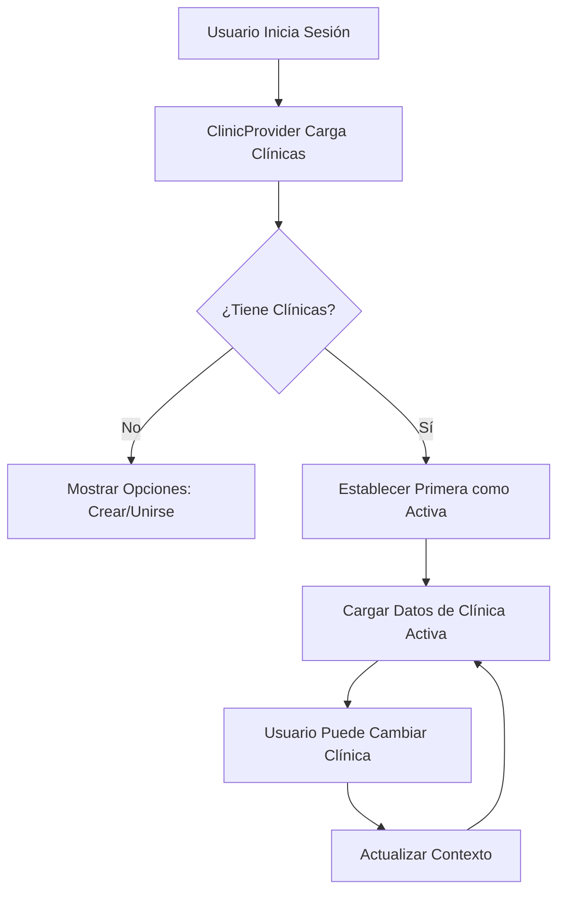

# Sistema Multi-Clínica - Implementación Completa

## 🎯 Resumen de la Implementación

Hemos refactorizado exitosamente la aplicación para permitir que un usuario (médico) pueda pertenecer a múltiples clínicas simultáneamente. La implementación incluye:

### ✅ Componentes Creados

1. **ClinicContext** (`src/context/ClinicContext.tsx`)
   - Maneja el estado global de la clínica activa
   - Proporciona funciones para crear, unirse y dejar clínicas
   - Carga automáticamente las clínicas del usuario

2. **ClinicSwitcher** (`src/components/layout/ClinicSwitcher.tsx`)
   - Componente dropdown para cambiar entre clínicas
   - Modal para crear nueva clínica
   - Modal para buscar y unirse a clínicas existentes
   - Muestra el rol del usuario en cada clínica

3. **Hook usePatients actualizado** (`src/hooks/usePatients.ts`)
   - Filtra pacientes por la clínica activa
   - Asegura que todas las operaciones CRUD respeten el contexto de clínica

### 📋 Cambios en la Base de Datos

La migración (`supabase/migrations/20250810008000_multi_clinic_system.sql`) crea:

1. **Tabla `clinics`**
   - Almacena información de cada clínica
   - Campos: id, name, address, phone, email, created_by, timestamps

2. **Tabla `clinic_members`**
   - Tabla pivote que conecta usuarios con clínicas
   - Define roles: admin, doctor, nurse, staff, pending_approval
   - Llave primaria compuesta (clinic_id, user_id)

3. **Políticas RLS**
   - Usuarios solo ven clínicas a las que pertenecen
   - Admins pueden gestionar sus clínicas
   - Control de acceso basado en membresías

4. **Funciones SQL**
   - `create_clinic_with_member()`: Crea clínica y añade al usuario como admin
   - `request_join_clinic()`: Solicita unirse a una clínica existente

### 🔧 Integración en la Aplicación

1. **App.tsx actualizado**
   - Envuelve la aplicación con `ClinicProvider`
   - Proporciona contexto global de clínica

2. **Navbar actualizado**
   - Incluye el `ClinicSwitcher` para usuarios con rol apropiado
   - Visible para: doctor, admin_staff, super_admin

3. **Edge Function** (`supabase/functions/search-clinics`)
   - Permite búsqueda segura de clínicas
   - Filtra clínicas donde el usuario ya es miembro

## 📝 Instrucciones de Implementación

### Paso 1: Aplicar la Migración a Supabase

1. Ve al [Dashboard de Supabase](https://app.supabase.com)
2. Selecciona tu proyecto
3. Ve a **SQL Editor** en el menú lateral
4. Crea una nueva consulta
5. Copia TODO el contenido de: `supabase/migrations/20250810008000_multi_clinic_system.sql`
6. Pégalo en el editor SQL
7. Haz clic en **Run** o presiona `Ctrl+Enter`

### Paso 2: Desplegar la Edge Function

1. En el Dashboard de Supabase, ve a **Edge Functions**
2. Crea una nueva función llamada `search-clinics`
3. Copia el contenido de: `supabase/functions/search-clinics/index.ts`
4. Despliega la función

### Paso 3: Reiniciar la Aplicación

```bash
# Detener el servidor si está corriendo
# Ctrl+C

# Iniciar nuevamente
npm run dev
```

## 🚀 Cómo Usar el Sistema

### Para Usuarios (Médicos/Staff)

1. **Primera vez**: Al iniciar sesión, verás el ClinicSwitcher vacío
2. **Crear Clínica**: 
   - Click en el dropdown → "Crear Nueva Clínica"
   - Ingresa nombre y dirección
   - Serás asignado como admin automáticamente

3. **Unirse a Clínica**:
   - Click en el dropdown → "Unirse a Clínica"
   - Busca por nombre
   - Solicita unirse (quedará pendiente de aprobación)

4. **Cambiar de Clínica**:
   - Click en el dropdown
   - Selecciona la clínica deseada
   - Toda la información se actualizará automáticamente

### Para Desarrolladores

```typescript
// Usar el contexto de clínica en cualquier componente
import { useClinic } from '../context/ClinicContext';

function MyComponent() {
  const { activeClinic, userClinics } = useClinic();
  
  // activeClinic contiene la clínica actual
  // userClinics contiene todas las membresías del usuario
}

// Ejemplo: Filtrar datos por clínica activa
const { data } = await supabase
  .from('patients')
  .select('*')
  .eq('clinic_id', activeClinic.id);
```

## 🔒 Seguridad

- Las políticas RLS aseguran que los usuarios solo vean datos de sus clínicas
- Los roles definen permisos específicos (admin, doctor, etc.)
- Las funciones SQL validan permisos antes de ejecutar operaciones

## 📊 Flujo de Datos



## 🐛 Solución de Problemas

### Error: "infinite recursion detected"
- **Causa**: Políticas RLS mal configuradas
- **Solución**: Aplicar la migración completa que incluye políticas corregidas

### No aparece el ClinicSwitcher
- **Verificar**: El rol del usuario debe ser doctor, admin_staff o super_admin
- **Verificar**: El ClinicProvider debe envolver la aplicación

### Error al buscar clínicas
- **Verificar**: La Edge Function está desplegada
- **Verificar**: El usuario tiene sesión activa

## 🎉 Resultado Final

Los usuarios ahora pueden:
- ✅ Pertenecer a múltiples clínicas
- ✅ Cambiar fácilmente entre clínicas
- ✅ Ver solo los datos de la clínica activa
- ✅ Crear nuevas clínicas
- ✅ Solicitar unirse a clínicas existentes
- ✅ Gestionar sus membresías

El sistema es completamente seguro, escalable y mantiene la integridad de los datos entre clínicas.
