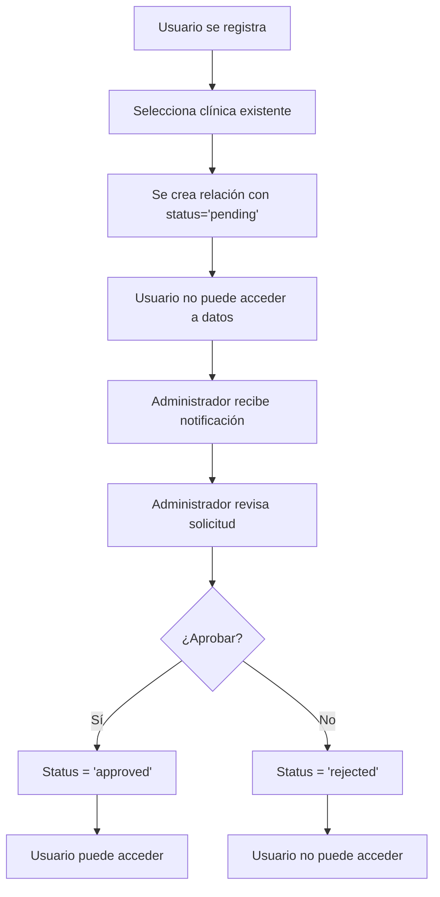

# 🔐 Sistema de Aprobación de Personal - DeepLux Med

## 📋 Descripción General

El **Sistema de Aprobación de Personal** es una funcionalidad crítica de seguridad que implementa un flujo de aprobación para nuevos usuarios que solicitan unirse a clínicas existentes. Este sistema garantiza que solo los administradores de la clínica puedan controlar quién tiene acceso a los datos sensibles de la organización.

## 🎯 Objetivos de Seguridad

- **Control de Acceso**: Evitar que cualquier persona pueda auto-asignarse a una clínica
- **Protección de Datos**: Garantizar que solo usuarios aprobados puedan acceder a información sensible
- **Auditoría Completa**: Rastrear todas las acciones de aprobación/rechazo
- **Cumplimiento**: Implementar políticas de seguridad a nivel de base de datos (RLS)

## 🏗️ Arquitectura del Sistema

### Base de Datos

#### Tabla `clinic_user_relationships` (Modificada)

```sql
-- Campos agregados:
status: 'pending' | 'approved' | 'rejected'  -- Estado de la solicitud
approved_by: UUID                            -- ID del usuario que aprobó
approved_at: TIMESTAMPTZ                     -- Fecha/hora de aprobación
rejection_reason: TEXT                       -- Razón del rechazo (opcional)
rejected_by: UUID                            -- ID del usuario que rechazó
rejected_at: TIMESTAMPTZ                     -- Fecha/hora del rechazo
```

#### Tabla `audit_logs` (Nueva)

```sql
-- Registra todos los cambios de estado:
id: UUID                                     -- Identificador único
table_name: TEXT                             -- Nombre de la tabla afectada
record_id: UUID                              -- ID del registro modificado
action: TEXT                                 -- Acción realizada
old_values: JSONB                            -- Valores anteriores
new_values: JSONB                            -- Valores nuevos
user_id: UUID                                -- Usuario que realizó el cambio
timestamp: TIMESTAMPTZ                       -- Fecha/hora del cambio
```

### Funciones RPC

#### `user_has_approved_access_to_clinic(clinic_id)`
Verifica si un usuario tiene acceso aprobado a una clínica específica.

#### `user_is_clinic_admin(clinic_id)`
Verifica si un usuario es administrador de una clínica específica.

#### `approve_clinic_user(user_id, clinic_id, approver_id)`
Aprueba un usuario para una clínica (solo administradores).

#### `reject_clinic_user(user_id, clinic_id, rejection_reason, rejector_id)`
Rechaza un usuario de una clínica (solo administradores).

### Políticas RLS (Row Level Security)

Todas las políticas existentes han sido actualizadas para incluir la condición:
```sql
AND status = 'approved'
```

Esto garantiza que **a nivel de base de datos**, los usuarios pendientes no puedan acceder a ningún dato.

## 🔄 Flujo de Funcionamiento

### 1. Registro de Nuevo Usuario



### 2. Proceso de Aprobación

1. **Administrador** ve solicitudes pendientes en la pestaña "Personal"
2. **Revisa** información del solicitante (nombre, email, rol solicitado)
3. **Aprueba** o **rechaza** la solicitud
4. **Sistema** actualiza el estado y registra la acción en auditoría
5. **Usuario** obtiene o pierde acceso inmediatamente

## 🎨 Interfaz de Usuario

### Panel de Administración

- **Pestaña "Personal"** en `ClinicAdminPage`
- **Estadísticas** en tiempo real (total, aprobados, pendientes, rechazados)
- **Filtros** por estado y búsqueda por nombre/email
- **Acciones** de aprobación/rechazo con confirmación
- **Historial** de cambios con timestamps

### Componentes React

- `ClinicStaffManagement.tsx` - Gestión principal del personal
- `ClinicStaffService` - Servicio para operaciones de backend
- Integración con `ClinicAdminPage` existente

## 🚀 Implementación Técnica

### Migración SQL

```bash
# Aplicar migración completa
node apply-staff-approval-migration.js

# O manualmente
npx supabase db reset
```

### Verificación

```bash
# Verificar que Supabase esté ejecutándose
npx supabase status

# Verificar estructura de la base de datos
npx supabase db diff --schema public
```

### Desarrollo

```bash
# Reiniciar aplicación después de cambios
npm run dev

# Verificar tipos TypeScript
npm run build
```

## 🔒 Seguridad Implementada

### Nivel de Base de Datos

- **RLS Policies** que requieren `status = 'approved'`
- **Funciones RPC** con verificación de permisos
- **Triggers** para auditoría automática
- **Índices** para performance y seguridad

### Nivel de Aplicación

- **Verificación de roles** antes de operaciones críticas
- **Validación** de entrada en todos los endpoints
- **Manejo de errores** robusto con mensajes informativos
- **Notificaciones** en tiempo real para el usuario

### Nivel de Interfaz

- **Confirmaciones** para acciones destructivas
- **Estados visuales** claros (pendiente, aprobado, rechazado)
- **Filtros** para facilitar la gestión
- **Responsive design** para diferentes dispositivos

## 📊 Monitoreo y Auditoría

### Logs de Auditoría

- **Cambios de estado** automáticamente registrados
- **Usuario responsable** de cada cambio
- **Timestamp** preciso de cada acción
- **Valores anteriores y nuevos** para trazabilidad

### Métricas Disponibles

- **Total de personal** por clínica
- **Solicitudes pendientes** que requieren atención
- **Tiempo promedio** de aprobación
- **Tasa de rechazo** por clínica

## 🧪 Testing y Verificación

### Casos de Prueba

1. **Usuario pendiente** no puede acceder a datos
2. **Administrador** puede aprobar/rechazar solicitudes
3. **Políticas RLS** funcionan correctamente
4. **Auditoría** registra todos los cambios
5. **Interfaz** muestra estados correctos

### Verificación Manual

```bash
# 1. Crear usuario nuevo
# 2. Verificar que aparece como "pending"
# 3. Aprobar desde panel de administración
# 4. Verificar que puede acceder a datos
# 5. Revisar logs de auditoría
```

## 🚨 Consideraciones Importantes

### Usuarios Existentes

- **Se marcan automáticamente** como `status = 'approved'`
- **No requieren** aprobación manual
- **Mantienen** acceso completo a la clínica

### Nuevos Usuarios

- **Siempre** tienen `status = 'pending'` por defecto
- **No pueden acceder** a datos hasta ser aprobados
- **Reciben** notificación clara del estado

### Administradores

- **Solo** pueden aprobar/rechazar en su clínica
- **Requieren** rol `admin_staff` o `super_admin`
- **Pueden** ver todas las solicitudes de su clínica

## 🔧 Mantenimiento y Troubleshooting

### Problemas Comunes

#### Usuario no puede acceder a datos
```sql
-- Verificar estado de la relación
SELECT status FROM clinic_user_relationships 
WHERE user_id = 'user_id' AND clinic_id = 'clinic_id';
```

#### Políticas RLS no funcionan
```sql
-- Verificar que las políticas estén habilitadas
SELECT * FROM pg_policies WHERE tablename = 'patients';
```

#### Funciones RPC no disponibles
```sql
-- Verificar permisos de las funciones
SELECT routine_name, routine_type 
FROM information_schema.routines 
WHERE routine_schema = 'public';
```

### Logs de Error

```bash
# Ver logs de Supabase
npx supabase logs

# Ver logs de la aplicación
npm run dev
```

## 📈 Mejoras Futuras

### Funcionalidades Planificadas

- **Notificaciones por email** para solicitudes pendientes
- **Aprobación en lote** para múltiples usuarios
- **Plantillas de rechazo** predefinidas
- **Métricas avanzadas** y reportes
- **Integración con** sistemas de identidad externos

### Optimizaciones Técnicas

- **Caché** para consultas frecuentes
- **Paginación** para listas grandes
- **WebSockets** para actualizaciones en tiempo real
- **Compresión** de logs de auditoría

## 📚 Recursos Adicionales

### Documentación Relacionada

- [Guía de Políticas RLS](../database/RLS_POLICIES.md)
- [Sistema de Autenticación](../auth/AUTH_SYSTEM.md)
- [Arquitectura de Base de Datos](../database/ARCHITECTURE.md)

### Archivos de Implementación

- `supabase/migrations/20250811000000_staff_approval_system.sql`
- `src/lib/services/clinic-staff-service.ts`
- `src/components/ClinicStaffManagement.tsx`
- `src/pages/ClinicAdminPage.tsx`

### Scripts de Utilidad

- `apply-staff-approval-migration.js` - Aplicar migración
- `test-staff-approval.js` - Probar funcionalidad

---

## 🎉 Conclusión

El Sistema de Aprobación de Personal proporciona una capa de seguridad robusta y auditable para DeepLux Med, garantizando que solo usuarios autorizados puedan acceder a los datos sensibles de las clínicas. La implementación es completa, segura y fácil de usar para los administradores.

**¡La seguridad de tus datos está garantizada! 🔒✨**
